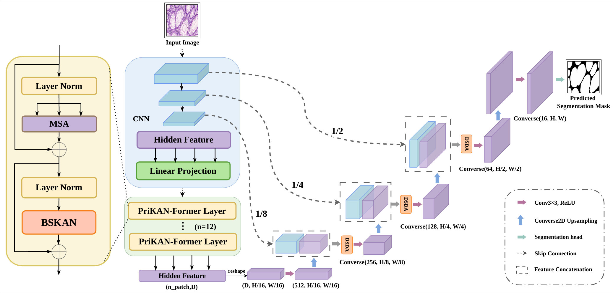

# BDC-TransUNet
This repo holds code for **Towards Boundary-Preserving Medical Image Segmentation: A Prior-Guided Deeply-Supervised Converse Transformer**.

<p align="center">
  
</p>

## Architecture

BDC-TransUNet integrates three novel components into the TransUNet framework:

- **PriKAN-Former (BSKAN)**: Replaces standard MLP in Transformer blocks with a boundary-selective KAN that routes boundary tokens through B-spline modeling.
- **DSDA**: Deeply-Supervised Dual Attention combining Position and Channel attention with auxiliary supervision at each decoder stage.
- **Converse Decoder**: FFT-based inverse convolution upsampling that recovers high-frequency details lost during downsampling.

## Usage

### 1. Download Google pre-trained ViT models
* [Get models in this link](https://console.cloud.google.com/storage/vit_models/): R50-ViT-B_16
```bash
wget https://storage.googleapis.com/vit_models/imagenet21k/R50+ViT-B_16.npz &&
mkdir -p pretrained_models &&
mv R50+ViT-B_16.npz pretrained_models/R50+ViT-B_16.npz
```

### 2. Prepare data

Download the datasets from the official sources and preprocess into `.npz` format. See [data/README.md](data/README.md) for detailed instructions.

The expected directory structure:

```
data/
├── GLAS/
│   ├── train_npz/
│   ├── val_npz/
│   └── test_npz/
├── Kvasir/
│   ├── train_npz/
│   ├── val_npz/
│   └── test_npz/
└── CVC/
    ├── train_npz/
    ├── val_npz/
    └── test_npz/
```

### 3. Environment

Please prepare an environment with python>=3.8, and then install dependencies:

```bash
pip install -r requirements.txt
```

### 4. Train/Test

- Train on GlaS dataset:

```bash
CUDA_VISIBLE_DEVICES=0 python train.py --dataset GLAS
```

- Train on Kvasir-SEG dataset:

```bash
CUDA_VISIBLE_DEVICES=0 python train.py --dataset Kvasir
```

- Train on CVC-ClinicDB dataset:

```bash
CUDA_VISIBLE_DEVICES=0 python train.py --dataset CVC
```

- Test with pretrained weights:

```bash
python test.py --dataset GLAS --model_path ./output/BDC_experiment/best_model.pth
```

### 5. Pretrained Models

Pretrained BDC-TransUNet weights are available for download:

| Dataset | Download |
|---------|----------|
| CVC-ClinicDB | [Google Drive](https://drive.google.com/file/d/1dy3-HNwkHrMWJkcL773nGPB6Aga4vL_Z/view?usp=drive_link) |
| GlaS | [Google Drive](https://drive.google.com/file/d/1Tpo7LlMpspC1YRsUnXOYRav-WYVDTNMA/view?usp=drive_link) |
| Kvasir-SEG | [Google Drive](https://drive.google.com/file/d/1euWLRZaJ0F3i8-HJJmrfpbjMHPuvG06x/view?usp=drive_link) |

Download the weights and test with:

```bash
python test.py --dataset GLAS --model_path ./pretrained_models/best_model_glas.pth
```

## Reference
* [TransUNet](https://github.com/Beckschen/TransUNet)
* [Google ViT](https://github.com/google-research/vision_transformer)

## Citations

If you find this work useful, please cite our paper (coming soon).
